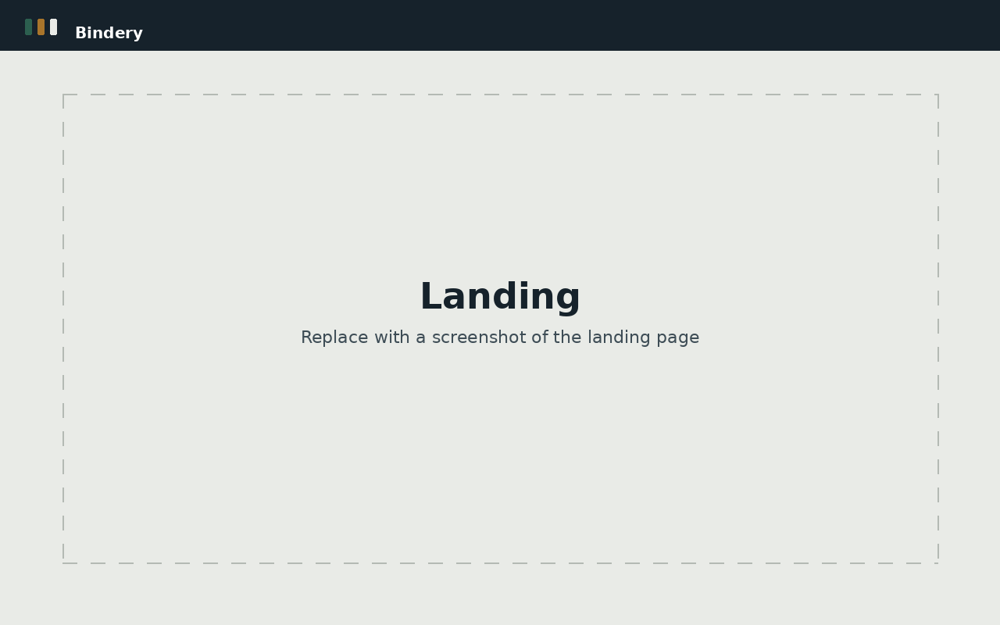
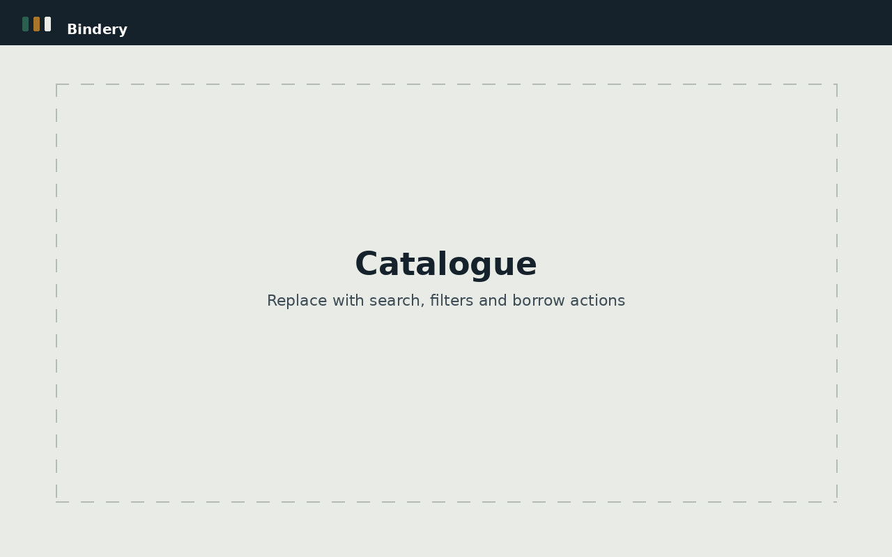
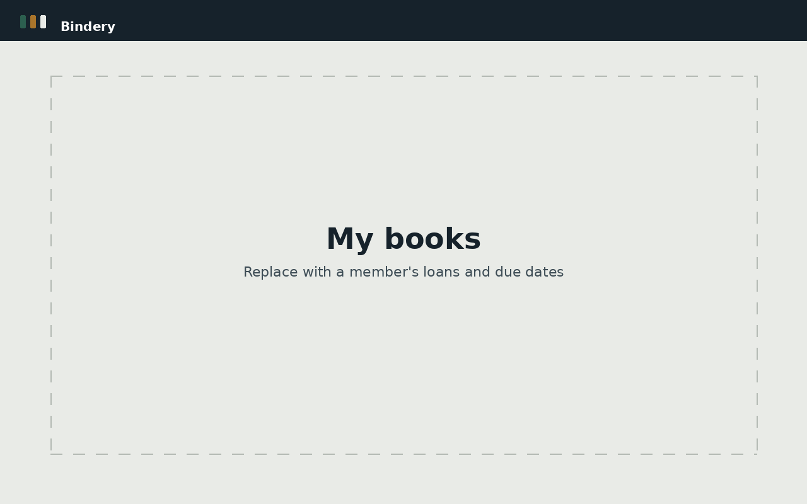
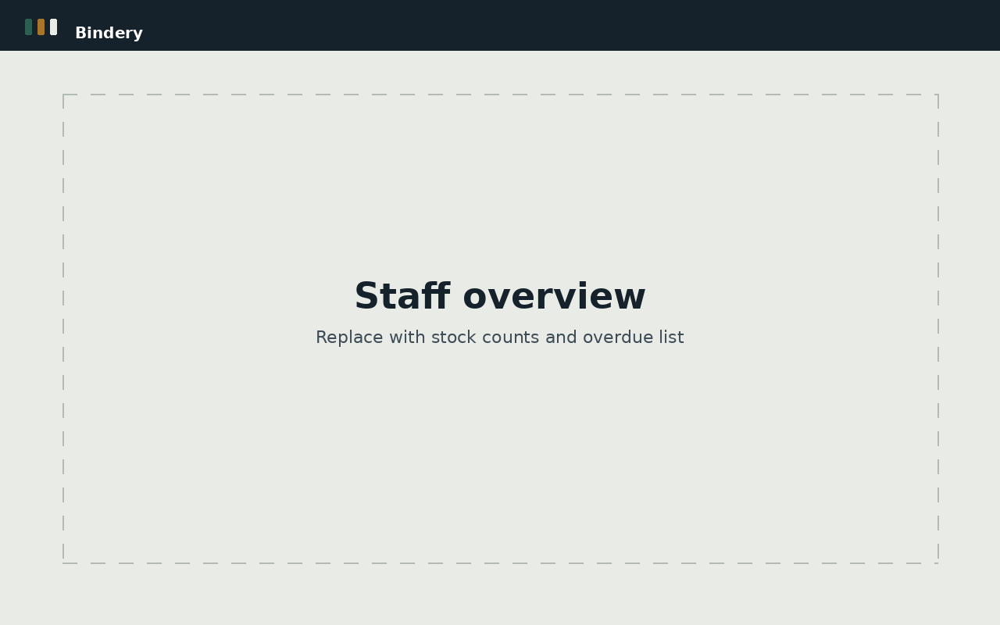
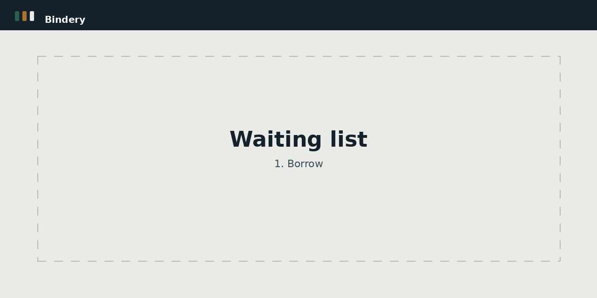

# Bindery

**A lending library that keeps its own records.** Catalogue, loans, waiting lists and an audit log,
in one app that members and staff both work from.

**[Live demo](   https://server-production-7113.up.railway.app)** · demo login `ayesha` / `Reader@123` · staff login `Admin` / `Admin@123`

> Replace the link above with your deployed URL once it is live.


---

This started as a 1,782-line C++ console program built around four hand-written data structures: a
dynamic array for users, a stack for the activity log, a queue per book for waiting lists, and a
binary search tree for the catalogue. State lived in five plain text files.

The rebuild keeps every rule the original enforced and fixes seven bugs it shipped with. The most
serious: each book's waiting list loaded from the same shared text file, so after a restart every
book inherited every queued username. The second: the borrower's name was written to disk but never
read back, so the check that stops you returning someone else's book silently stopped working on
restart.

[`docs/MIGRATION.md`](./docs/MIGRATION.md) maps each original rule to its replacement, line by line,
and lists what was deliberately changed rather than ported.

---

## Screenshots

> Placeholders. Drop the real images into `docs/screenshots/` using these filenames and they will
> appear here automatically.

| Landing | Catalogue |
| --- | --- |
|  |  |

| Member dashboard | Staff dashboard |
| --- | --- |
|  |  |

**Borrow → queue → hold → collect**



---

## What it does

**Members** search the catalogue by title, author, genre or shelf ID, borrow anything on the shelf,
and join a queue for anything that is out. They see their own loans, due dates and history.

**Staff** add, edit and remove stock, borrow and return on a member's behalf, see every active loan
and which are overdue, manage the queues, and read the full activity log.

**Waiting lists** run first come, first served. When a book comes back it is held for the next
person for 48 hours and nobody else can take it. If they do not collect it, the hold expires, they
are notified, and it passes down the queue. Expiry is swept on a timer and again on every catalogue
read, so a queue never stalls waiting for traffic.

**Every borrow and return** is written to an append-only log with the member, book, genre and
timestamp, read newest first.

## How it is built

| | |
| --- | --- |
| **API** | Node.js, Express, TypeScript. Zod validates every request body, query and route param. |
| **Data** | Prisma over SQLite. Seven tables replace the original five text files. |
| **Auth** | JWT sessions, bcrypt password hashing, role-based route guards. |
| **UI** | React, TypeScript, Tailwind CSS, TanStack Query, React Router. |
| **Deploy** | One service. The API serves the React build from the same origin. |

A few decisions worth calling out:

- **The BST is gone.** It gave fast lookup by ID and nothing else, so title, author and genre
  search were impossible. Indexed columns match its lookup speed and support all four.
- **Money-path operations run in a transaction.** Borrowing checks availability, creates the loan,
  flips the book, closes the queue entry and writes the log entry atomically, so two people cannot
  borrow the same copy in a race.
- **Failed borrows are no longer logged as successes.** The original wrote "Borrowed book" even
  when the borrow failed and the user was only queued.
- **Passwords are hashed**, so the original's "would you like to see your password?" screen was
  impossible to keep. The replacement checks the same username and email pair and issues a
  single-use reset token valid for 30 minutes.

## Running it locally

Node 18.18 or newer.

```bash
git clone https://github.com/AbdulAakhirsaifullah/library-management-system.git
cd library-management-system

cp server/.env.example server/.env    # then set JWT_SECRET
npm install
npm run db:push                       # create the SQLite database
npm run seed                          # 24 books, 2 members, 1 staff account
npm run dev                           # API on :4000, UI on :5173
```

Open <http://localhost:5173>.

| Role | Username | Password |
| --- | --- | --- |
| Staff | `Admin` | `Admin@123` |
| Member | `ayesha` | `Reader@123` |
| Member | `daniyal` | `Reader@123` |

`npm run setup` runs the install, push and seed together.

### Scripts

| Command | What it does |
| --- | --- |
| `npm run dev` | API and UI together, both hot-reloading |
| `npm run build` | Builds the React bundle, then compiles the server |
| `npm start` | Runs the production build |
| `npm run typecheck` | Type-checks both workspaces |
| `npm run db:push` | Applies `schema.prisma` to the database |
| `npm run db:studio` | Browse the data in Prisma Studio |
| `npm run seed` | Seed sample data, safe to re-run |

### Configuration

Every variable is documented with a comment in [`server/.env.example`](./server/.env.example) and
validated on boot. A missing or malformed value stops the server with a message naming it, rather
than failing later at runtime. In production the server also refuses to start while `JWT_SECRET` or
`ADMIN_PASSWORD` is still the default that ships in this repo.

## Deploying

One service on Railway with a volume for the SQLite file. The API serves the React build, so there
is one deploy, one URL, no CORS config and no cross-origin cookie problem.

1. Create a Railway project from the repo.
2. Add a volume mounted at `/data`.
3. Set `NODE_ENV=production`, `DATABASE_URL=file:/data/library.db`, a real `JWT_SECRET`, and an
   `ADMIN_PASSWORD` of your own.
4. Deploy. `railway.json` sets the build and start commands and points the health check at
   `/api/health`. The start command applies the schema before booting.
5. Seed once from the Railway shell: `npm run seed`.

Moving to Postgres later is a provider change in `schema.prisma` plus a new `DATABASE_URL`.

## Project layout

```
├─ server/              Express + Prisma API
│  ├─ prisma/           Schema and seed script
│  └─ src/
│     ├─ lib/           Validation rules ported from C++, JWT, bcrypt, logger
│     ├─ middleware/    Auth, role guards, Zod validation, error handler
│     └─ modules/       auth · books · loans · waitlist · activity · admin
└─ client/              React + Vite + Tailwind
   └─ src/
      ├─ pages/         Landing, auth, catalogue, book, loans, queues, notices
      ├─ pages/admin/   Overview, stock, loans, queues, log, members
      ├─ components/    UI primitives, layout, error boundary
      └─ hooks/         TanStack Query hooks and mutations
```

Full API reference and the original setup notes are in
[`docs/SETUP-REFERENCE.md`](./docs/SETUP-REFERENCE.md).

## Known limits

Worth stating plainly rather than leaving for a reviewer to find:

- **The password reset token is returned in the API response.** There is no mail server wired up, so
  the flow is demoable end to end. Before this faces real users the token has to be emailed instead
  and dropped from the response body.
- **JWTs are stored in `localStorage`**, which is readable by any script on the page. An httpOnly
  cookie with CSRF protection is the safer choice for production.
- **SQLite ties the app to one instance.** Fine at this size, wrong the moment you need two.
- **No automated tests yet.** The validation rules in `server/src/lib/rules.ts` and the hold expiry
  logic in `holds.service.ts` are the two places that most need them.

## License

MIT. See [LICENSE](./LICENSE).

Built by Abdul Aakhir Saifullah.
